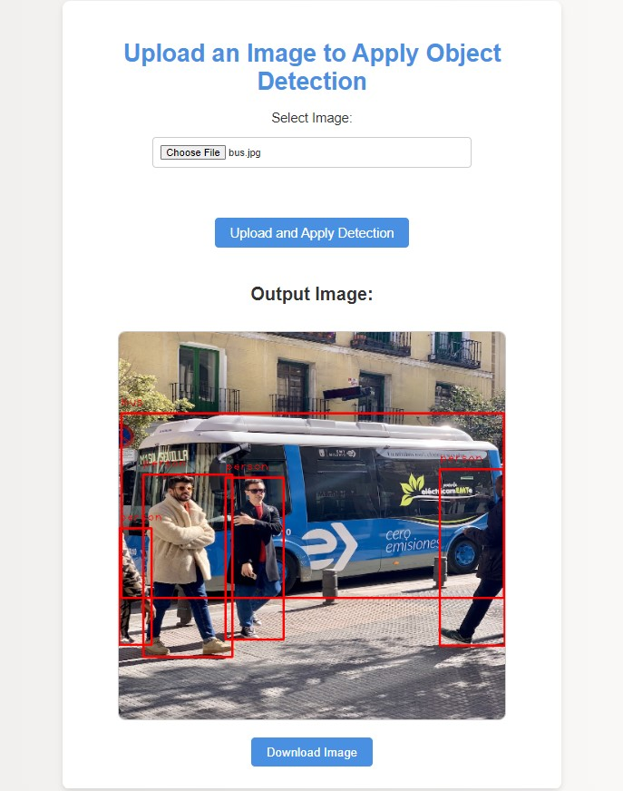

# Object Detection Flask Application

This repository contains a Flask-based web application for object detection using the YOLO (You Only Look Once) model. The application can process images and video streams, detecting objects and displaying the results.

<div>
    
</div>

## Features

- Upload an image and get the detected objects highlighted.
- Real-time object detection from a video stream.

## Requirements

- Python 3.6+
- Flask
- ultralytics
- numpy
- pillow
- opencv-python
- werkzeug

## Setup

1. Clone the repository:

```bash
git clone https://github.com/givkashi/Object-Detection-Yolo-Flask.git
cd Object-Detection-Yolo-Flask
```

2. Download the YOLO weights from [[here](https://github.com/ultralytics/ultralytics)] and place them in the object_detection directory.

3. Running the Application
To start the Flask application, run:
```bash
python app.py
```
The application will be available at http://localhost:8000.

Usage
Image Upload
1. Open your browser and navigate to http://localhost:8000.
2. Upload an image file.
3. The application will process the image and display the detected objects.

Real-time Video Detection
1. Open your browser and navigate to http://localhost:8000/video.
2. The application will start the webcam and display the real-time object detection.
